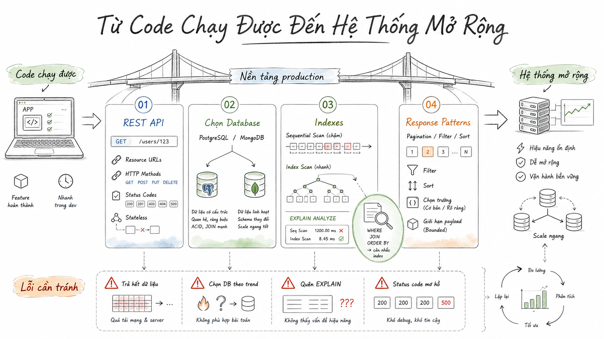

# Engineering Manuscript Illustration

## Preview



Turn the user's topic, object, workflow, steps, product concept, or article idea into a modern product-design manuscript illustration with white-background blueprint linework, and by default call `imagegen` directly to generate the image.

## Top-Level Metadata

- **Default aspect ratio**: `16:9`
- **Default language**: Vietnamese
- **Default output**: generate the image directly
- **Underlying tool**: use the system `imagegen` skill's default built-in `image_gen` tool
- **Default background**: pure white `#FFFFFF`
- **Default feel**: clean, professional, technological, modern product-design manuscript
- **Default for continued conversations**: if the previous image or revision used this skill, and the user has not explicitly requested a different style, continue using the white-background engineering manuscript linework style, pale watercolor accents, and engineering annotation language

## Fixed System Setup

```text
You are a visual designer who specializes in engineering manuscripts, product design sketches, and technology infographics.

First understand the user's topic, then translate the content into a clear, restrained, modern engineering manuscript illustration.

Do not copy entire passages of source text into the image. Keep only necessary titles, step names, annotation terms, and a few short phrases.
```

## Use Cases

Prefer this skill for requests such as:

- Engineering manuscript illustrations, hand-drawn engineering-style images, blueprint-style supporting visuals
- Product design sketches, structural exploded diagrams, concept product explanation diagrams
- Step-by-step diagrams, flowcharts, method diagrams, module relationship diagrams
- Technology-style infographics, course visuals, PPT illustrations, article illustrations
- Modern explanatory diagrams with an Apple/Tesla-like product design manuscript feel

Do not use this skill if the user wants realistic photography, heavy cyberpunk, 3D rendering, comic characters, cute notebook journaling, complex commercial posters, oil painting, ink painting, or pure SVG/HTML graphics.

## Reference Files

- **[references/visual-style.md](references/visual-style.md)**: Fixed visual specifications. Read this before writing the final imagegen prompt, maintaining series consistency, or handling style transfer from reference images.

## Core Workflow

### Step 1: Decide The Output Mode

- Default mode: prepare the final image prompt and call `image_gen` directly
- Only output the final prompt without generating an image when the user explicitly says "prompt only", "do not generate an image", or "give me the prompt"
- If the user provides content and asks for an illustration/drawing/generation, do not repeatedly ask follow-up questions; translate it visually and generate the image

### Step 2: Understand The Content, Then Compress It Into 1 To 3 Visual Focal Points

Prioritize extracting:

- **Theme**: what the image should explain
- **Subject**: product, device, system, process, method, or abstract concept
- **Structure**: steps, modules, causality, contrast, paths, or exploded relationships
- **Annotations**: numbering, leader lines, arrows, magnified details, dimension lines, labels
- **Text in the image**: keep only 1 to 6 short Vietnamese phrases; do not copy long passages

Rules:

- For product or system topics, prefer a central object plus surrounding annotations
- For methods and steps, prefer a horizontal path, numbered nodes, or an exploded process
- For abstract concepts, prefer a structural diagram or a lightweight icon combination
- Compress complex content into a clear engineering explanation without overcrowding the canvas
- Do not place the user's original wording verbatim as full paragraphs in the image

### Step 3: Read The Fixed Visual Style

Before writing the final imagegen prompt, read `references/visual-style.md` and merge its requirements for background, linework, annotations, pale color accents, Vietnamese typography, and prohibited elements into the prompt.

### Step 4: Write The Final Imagegen Prompt

The prompt must include:

- Style summary: white-background engineering manuscript, product design sketch, blueprint linework, modern technology infographic
- Content theme: distilled from the user's content, not copied verbatim
- Main composition: what exactly appears in the image and how elements are positioned
- Engineering annotations: numbering, leader lines, arrows, callout labels, magnified detail notes
- Line language: delicate, precise, clean, dark-gray line art; never heavy thick black lines
- Pale color accents: pale blue, pale green, pale orange, high-transparency watercolor emphasis
- Vietnamese text: dark-gray handwritten-style title; annotation terms should be accurate, clear, and print-grade readable
- Aspect ratio: `16:9`
- Prohibited elements: no black or heavy dark background, no cyberpunk, no strong gradients, no 3D rendering, no crowded layout

### Step 4.5: Hard Constraints For Series Consistency

When the current turn is part of a continued conversation, an image series, an extension of the same topic, a revision of the previous image, or the user has not explicitly requested a style change, the final prompt must include consistency constraints:

- Continue the previous image/revision's white-background engineering manuscript style
- Keep dark-gray fine linework, engineering annotations, and pale blue/pale green/pale orange high-transparency watercolor accents
- Keep the modern product design manuscript feel; do not turn it into comics, notebook journaling, realistic rendering, or cyberpunk
- Adjust only the subject object, step structure, icons, annotation content, and composition according to the new topic

### Step 4.6: Reference Image Style Transfer Rules

When the user provides a reference image and asks to follow that style or make something like it:

- First extract the reference image's composition, subject proportions, annotation methods, whitespace rhythm, and line density
- Still preserve this skill's white-background engineering manuscript, fine linework, pale color accents, and modern technological feel
- If the reference image is heavily colored, reduce saturation and transparency so watercolor serves only as light emphasis
- If the reference image contains a lot of text, compress it into a few titles, numbers, and annotation terms

### Step 5: Call Imagegen

When generating an image directly:

- Call the built-in `image_gen` with the prepared final prompt
- Generate only the image requested in that turn; if the user requests multiple images, generate them separately
- After generation, do not output a long explanation; briefly state that it has been generated, and include the final prompt or saved path only if needed

## Default Imagegen Prompt Template

Use this structure, but rewrite it naturally for the user's topic:

```text
Use case: engineering-sketch-infographic
Asset type: Vietnamese 16:9 white-background engineering manuscript illustration
Primary request: Convert the user's content into a clean, professional, technological engineering-manuscript-style explanatory image. Do not copy the source text verbatim; keep only the core information.

You are a visual designer who specializes in engineering manuscripts, product design sketches, and technology infographics. First understand the topic, then draw it as a Vietnamese explanatory image in a modern product design manuscript style.

Use a pure white #FFFFFF background, generous whitespace, and a horizontal 16:9 canvas. The image should use delicate, precise, clean engineering blueprint linework with dark-gray line art, like Apple/Tesla product design manuscripts, modern industrial design concept sketches, and structural diagrams. The title should use a restrained, modern, professional dark-gray handwritten style.

Topic content: [distilled theme]

Image composition:
- [central subject or main device/system/concept]
- [steps, modules, or structural relationships]
- [magnified details, icons, lightweight charts, or supporting notes]

Engineering annotation method:
- Use numbered nodes, fine leader lines, arrows, callout labels, magnified detail frames, dimension lines, or exploded annotations
- Pair concise icons with step explanations without stacking complex elements
- Make the reading path clear, with information moving left to right or expanding from the center outward

Color and texture:
- Use dark-gray line art as the primary visual language
- Use pale blue, pale green, and pale orange high-transparency watercolor accents only as light emphasis
- Watercolor must not dominate; avoid large color blocks and strong gradients

Use Vietnamese text in the image, keeping only key points. It may include:
- [title]
- [keyword 1]
- [keyword 2]
- [keyword 3]

Vietnamese must be accurate and natural. Text should be clear, sharp, treated as an independent layer, and print-grade readable. Do not create dense text blocks or place entire source passages in the image.

Prohibited: no black or dark background; no heavy thick black linework; no cyberpunk; no strong gradients; no 3D rendering, shadows, metallic texture, or realistic photography; no crowded background, excessive decoration, or chaotic layout. Keep it clean, professional, technological, and spacious. Aspect ratio 16:9.
```

## Output Modes

### Default Direct Image Generation

Call `image_gen` to generate the image. Keep the response brief and do not output a long analysis.

### Prompt Only

If the user explicitly requests only the prompt, output:

```markdown
# Engineering Manuscript Illustration Prompt

## Final Prompt
[complete prompt ready for imagegen]
```

### Multiple Concepts

If the user asks for several directions or 3 versions, output at most 3 concepts. If the user then requests image generation, call `image_gen` using the user's chosen concept or default to the first concept.

## Do / Don't

Do:

- Understand the content before visually translating it
- Call imagegen directly by default to generate the image
- Compress complex information into a small number of visual focal points
- Use a white background, generous whitespace, and fine dark-gray line art
- Use engineering annotations, numbering, leader lines, arrows, and magnified detail notes
- Use only pale blue, pale green, and pale orange high-transparency watercolor as light emphasis
- Emphasize accurate Vietnamese, independent text layers, and print-grade readability

Don't:

- Output only analysis without generating an image unless the user explicitly asks for prompt only
- Copy the user's original wording as full paragraphs into the image
- Use heavy black backgrounds, cyberpunk, strong gradients, 3D rendering, or realistic photography
- Let watercolor color blocks dominate the image
- Use crowded backgrounds, excessive decoration, or chaotic layouts
- Turn the engineering manuscript into children's doodles, cute notebook journaling, or comic posters
