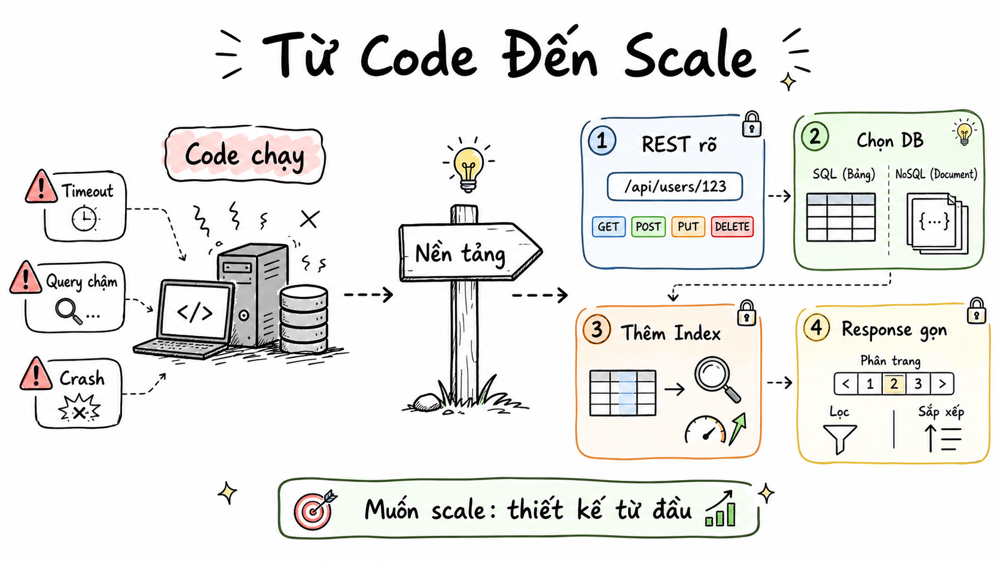

# Pure White Hand-Drawn PPT Infographic

Turn the user's new content into a 16:9 horizontal PPT image with a pure white background, hand-drawn whiteboard texture, and pale-color information layers. By default, call the `imagegen` skill / built-in `image_gen` tool to generate the image.

## Preview



`assets/preview.png` is the 16:9 sample image the user approved when this skill was created. It demonstrates the target visual style. When generating new images later, do not copy the preview image content; only reuse its visual system and layout language.

## Defaults

- **Aspect ratio**: 16:9 horizontal.
- **Background**: pure white background with clean whitespace; no off-white, gray background, gradients, paper texture, or large background color blocks.
- **Image generation method**: use the `imagegen` skill, which calls the built-in `image_gen` tool underneath.
- **Default delivery**: when the user asks for an image, generation, supporting visual, PPT image, or presentation page, prepare the final prompt and call `image_gen`; when the user explicitly asks for prompt only, do not call image generation.

## Use Cases

- Explain methodologies, workflows, product concepts, or AI Agent / Skills systems as a horizontal PPT infographic.
- Express comparisons such as "old way vs new way", "chaotic stacking vs clear path", or "open capability vs fixed process".
- Explain 3 to 6 steps, modules, constraints, feedback points, or continuous improvement loops.
- Generate horizontal article visuals, course PPT illustrations, or hand-drawn explanation pages for talks.

## Style Rules

- **Overall positioning**: like an original hand-drawn explanation graphic in a knowledge-sharing PPT: relaxed, clear, readable, and unlike a commercial poster or complex UI.
- **Canvas and whitespace**: 16:9 horizontal, large margins, plenty of blank space, with the main subject occupying the central 70%-80% of the canvas; connect content with hand-drawn arrows, dashed lines, and branching paths.
- **Background**: strictly pure white background with clean breathing room; do not use gray backgrounds, beige backgrounds, paper texture, shadow panels, or gradient lighting effects.
- **Color system**: black-gray for primary linework and text; pale blue, pale green, pale orange, and pale yellow for labels, rounded cards, paths, or emphasis lines; colors should be transparent and soft, like a light marker sweep.
- **Layout structure**: prefer left-right comparison, central signpost/turning point, horizontal flow, branching path, or central theme with surrounding short labels. The structure should be immediately understandable; do not mix too many graphic logics.
- **Text hierarchy**: place a large handwritten-style title at the top or upper left; use only 2 to 6 Vietnamese characters for labels in central modules; optionally place one short conclusion at the bottom. Avoid long paragraphs and dense small text.
- **Graphic language**: black-gray hand-drawn outlines, rounded labels, sticky notes, dashed frames, arrows, hand-drawn signposts, small lightbulbs, small locks, small targets, numbered steps, branching paths, and other lightweight icons.
- **Texture**: hand-drawn whiteboard feel, fine-line pen, pale-color marker strokes, slight line irregularity; keep it clean and professional, with no dirty smudging.
- **Variable content slots**: title, two left-right concept groups, 3 to 6 steps or labels, and one bottom conclusion can all be replaced; signposts, arrows, pale color labels, and hand-drawn icons are fixed style language.
- **Avoid**: logos, watermarks, public-account wording, real people, photos, 3D, glassmorphism, heavy shadows, complex gradients, full original text from a reference image, and proprietary copyrighted characters.

## Core Workflow

### Step 1: Distill The Content

Compress the user's input into information suitable for a single image:

- One handwritten-style Vietnamese title with 4 to 12 characters.
- One core conclusion, placed at the bottom if needed.
- Two comparison sides, or 3 to 6 flow nodes, path choices, constraints, or feedback steps.
- Each node should keep a short 2 to 6 Vietnamese-character label, preferably a noun phrase or verb phrase.

If the user provides a long text, do not copy the original text into the image. First rewrite it into structured labels, flow nodes, or left-right comparison dimensions.

### Step 2: Apply A Layout

Choose one structure based on the content:

- **Left-right comparison**: draw the problem, chaos, or old way on the left; use a signpost, arrow, or branching path as the turn in the middle; draw a clear process or new way on the right.
- **Horizontal flow**: arrange 3 to 6 pale-color rounded cards from left to right and connect them with hand-drawn arrows.
- **Branching path**: extend a central signpost or theme node in multiple directions, suitable for choices, strategies, or capability boundaries.
- **Open framework**: use a large frame on the left for goals/boundaries/path, and small cards on the right for rules, feedback, and optimization.
- **Closed-loop iteration**: place 4 to 5 nodes around the central theme to form a "scenario-boundary-execution-feedback-optimization" loop.

Keep a single image focused on one core relationship. The result should look like a carefully drawn PPT whiteboard page, not a screen full of stickers.

### Step 3: Organize The Imagegen Prompt

Write the prompt in this order:

1. State the image type and aspect ratio: 16:9 horizontal PPT infographic.
2. Emphasize the pure white background: it must be pure white, with no off-white, gray background, texture, or gradient.
3. Describe the hand-drawn style: black-gray lines, pale-color markers, rounded labels, dashed arrows, signposts, and lightweight icons.
4. Describe the topic and structure: title, left-right/flow/path relationship, and short label for each node.
5. Limit the text: Vietnamese short labels, clear readability, and no dense small text.
6. Add negative constraints: no logo, watermark, public-account wording, photos, 3D, complex backgrounds, or proprietary copyrighted characters.

### Step 4: Call Imagegen

- When the user explicitly asks to generate an image, directly generate, draw one, provide a supporting image, or create a PPT image, call `image_gen` with the final prompt.
- If the user only wants the prompt, output the complete prompt and do not call image generation.

## Prompt Template

```text
Generate a 16:9 horizontal PPT-style image in the style of a pure white hand-drawn PPT infographic.

Topic: [user topic]
Title: [4 to 12 Vietnamese-character title]
Image structure: [left-right comparison / horizontal flow / branching path / open framework / closed-loop iteration]
Main content:
- [module 1: 2 to 6 Vietnamese-character short label]
- [module 2: 2 to 6 Vietnamese-character short label]
- [module 3: 2 to 6 Vietnamese-character short label]
- [module 4: if needed]
- [module 5: if needed]
Bottom conclusion: [optional, one short conclusion]

Visual requirements: pure white background with clean whitespace; black-gray hand-drawn outlines and a handwritten-style Vietnamese title; a small amount of pale blue, pale green, pale orange, and pale yellow semi-transparent marker color blocks; use rounded labels, sticky notes, dashed arrows, branching paths, hand-drawn signposts, small lightbulbs, small locks, small targets, numbered steps, and other lightweight icons; overall it should look like an original hand-drawn explanation graphic in a knowledge-sharing PPT, with clear information and strong breathing room.

Text requirements: use only Vietnamese short labels and a few short phrases. Text must be clear and readable, not dense or occluded.

Restrictions: no logo; no watermark; no public-account wording; do not copy the specific content of a reference image; no photos; no 3D; no glassmorphism; no heavy shadows; no gray or beige background; no paper texture; no complex gradients; no proprietary copyrighted characters. The image aspect ratio must be 16:9.
```

## Image Generation Rules

- Generate a single 16:9 horizontal image by default.
- Before calling image generation, you may briefly provide the final prompt, but do not explain the design process at length.
- If the user does not provide a specific topic, infer it from context first; if it truly cannot be inferred, ask one short question.
- When generating an image series, keep the pure white background, hand-drawn black-gray lines, pale color labels, icon density, title size, and whitespace ratio consistent.
